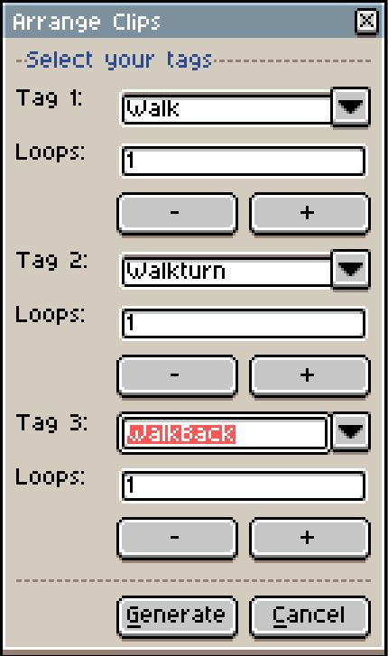

# Aseprite-Scripts
My personal Aseprite scripts. Feel free to [download](https://github.com/Fantailed/Aseprite-Scripts/archive/v0.1.1.zip) and use :)

## Arrange Clip

Have you ever wanted to create a short clip out of an arrangement of tagged animations but found it bothersome to arrange it yourself?
Then hopefully, you will find this script helpful.  
Just define which tags you want to be played one after the other and how many times each of them should be looped.
Upon pressing "Generate", it will create a new .aseprite file cut to your needs!
